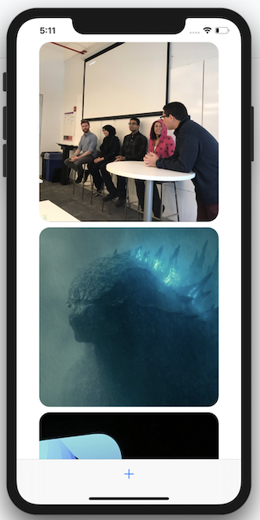

# ImagePicker

Using UIImagePickerController. 



#### Set your class as the delegate for UIImagePickerController

```swift 
imagePickerController.delegate = self 
````

#### UIImagePickerDelegate methods 

```swift 
extension ImagesViewController: UIImagePickerControllerDelegate, UINavigationControllerDelegate {
  func imagePickerControllerDidCancel(_ picker: UIImagePickerController) {
    dismiss(animated: true)
  }
  
  func imagePickerController(_ picker: UIImagePickerController, didFinishPickingMediaWithInfo info: [UIImagePickerController.InfoKey : Any]) {
    guard let image = info[UIImagePickerController.InfoKey.originalImage] as? UIImage else {
      return
    }
    selectedImage = image
    dismiss(animated: true)
  }
}
```

#### Checking if the camera is available 

```swift 
if UIImagePickerController.isSourceTypeAvailable(.camera) {
  alertController.addAction(cameraAction)
}
```

#### info.list key needed to access the camera 

If the NSCameraUsageDescription is not added in the info.plist the following crash will occur. 
> This app has crashed because it attempted to access privacy-sensitive data without a usage description.
> The app's Info.plist must contain an NSCameraUsageDescription key with a string value explaining to the
> user how the app uses this data.

#### Resizing a UIImage to reduce the in app memory size 

```swift 
extension UIImage {
  func resizeImage(to width: CGFloat, height: CGFloat) -> UIImage {
    let size = CGSize(width: width, height: height)
    let renderer = UIGraphicsImageRenderer(size: size)
    return renderer.image { (context) in
      self.draw(in: CGRect(origin: .zero, size: size))
    }
  }
}
```

#### Keeping the aspect ratio of a UIImage 

```swift 
import AVFoundation

let rect = AVMakeRect(aspectRatio: image.size, insideRect: UIScreen.main.bounds)
```

#### Converting a UIImage object to Data for persisting to disk 

```swift 
let imageData = resizedImage.jpegData(compressionQuality: 1.0)
```

#### Useful to create an identifier for custom objects 

Comes in very handy when conforming your object to **hashable** for uniqueness. 

```swift 
struct ImageObject: Codable {
  let imageData: Data
  let date: Date
  let identifier = UUID().uuidString
}
```

#### Present an action sheet via UIAlertController 

```swift 
private func showDeleteAlert(forCell indexPath: IndexPath) {
  let alertController = UIAlertController(title: nil, message: nil, preferredStyle: .actionSheet)
  let cancelAction = UIAlertAction(title: "Cancel", style: .cancel)
  let deleteAction = UIAlertAction(title: "Delete", style: .destructive) { [weak self] alertAction in
    self?.deleteImageObject(indexPath: indexPath)
  }
  alertController.addAction(cancelAction)
  alertController.addAction(deleteAction)
  present(alertController, animated: true)
}
```

#### Adding a long press gesture to a view 

```swift 
private lazy var longPressGesture: UILongPressGestureRecognizer = {
  let gesture = UILongPressGestureRecognizer()
  gesture.addTarget(self, action: #selector(longPress(gesture:)))
  return gesture
}()

addGestureRecognizer(longPressGesture)

@objc
private func longPress(gesture: UILongPressGestureRecognizer) {
  if gesture.state == .began {
    gesture.state = .cancelled
    return
  }
  delegate?.didLongPressOnCell(self)
}
```
